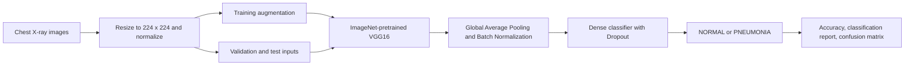

# Pneumonia Detection Using VGG16 Transfer Learning

A deep learning project for binary classification of chest X-ray images as **NORMAL** or **PNEUMONIA** using a fine-tuned VGG16 convolutional neural network. The project combines ImageNet transfer learning, image augmentation, and staged fine-tuning to obtain **89.74% test accuracy** with **0.98 recall for pneumonia** on the evaluated test split.

> **Important:** This project is intended for research and educational use. It is not a clinically validated diagnostic system and must not be used to make medical decisions.

## Research Recognition

The work behind this repository was submitted as the co-authored manuscript **"Transfer Learning-Driven Pneumonia Classification Using VGG16 with Fine-Tuned Feature Extraction and Explainability on Chest X-Ray Images"** (Paper ID: 48) and was **accepted for oral presentation** at the **International Conference on Next Generation Communication & Information Processing (INCIP 2026)**, scheduled for August 20-21, 2026 at the Central University of Karnataka.

The team did not proceed with conference registration or presentation. This repository therefore claims **acceptance for oral presentation only** and does not claim that the paper was presented, published in the conference proceedings, or indexed in IEEE Xplore.

## Project Overview

Pneumonia can appear in chest radiographs as changes such as opacities or consolidations, making chest X-ray classification a useful computer vision research task. This project adapts the VGG16 architecture to classify pediatric chest X-ray images into two classes:

- `NORMAL`
- `PNEUMONIA`

The implementation is provided in [`FINAL_PNUEMONIA.ipynb`](./FINAL_PNUEMONIA.ipynb), and the accompanying manuscript is available as [`Pneumonia Detection VGG16.pdf`](./Pneumonia%20Detection%20VGG16.pdf).

### Research Contribution

This study investigates whether a compact adaptation of VGG16 can deliver strong pneumonia sensitivity without training a deep convolutional network from scratch. The experiment:

- replaces VGG16's original classifier with a smaller regularized classification head;
- applies staged feature extraction and selective fine-tuning within one training workflow;
- evaluates the best validation checkpoint on a held-out test split using class-wise metrics; and
- identifies limitations that must be addressed before any clinical interpretation.

## Features

- Transfer learning with an ImageNet-pretrained VGG16 convolutional base
- Custom classification head using global average pooling, batch normalization, dense layers, and dropout
- Training-time augmentation for improved generalization on X-ray images
- Two-stage training: frozen feature extraction followed by selective fine-tuning
- Checkpointing of the best validation-accuracy weights
- Evaluation with accuracy, precision, recall, F1-score, a confusion matrix, and training curves
- Research paper included alongside the executable notebook

## Dataset

The research paper identifies the dataset as the publicly available [**Chest X-Ray Images (Pneumonia)** dataset](https://www.kaggle.com/datasets/paultimothymooney/chest-xray-pneumonia) by Paul Mooney on Kaggle. The image dataset is not committed to this repository and must be downloaded separately in accordance with its source terms.

The notebook expects the following input layout:

```text
chest_xray/
|-- train/
|   |-- NORMAL/
|   `-- PNEUMONIA/
`-- test/
    |-- NORMAL/
    `-- PNEUMONIA/
```

Rather than loading a separate validation directory, the notebook creates a stratified validation split from `chest_xray/train` using `test_size=0.2` and `random_state=42`.

### Split Used in the Notebook

| Split | Images | How it is obtained |
| --- | ---: | --- |
| Training | 4,172 | 80% of the loaded training directory |
| Validation | 1,044 | 20% stratified split from the loaded training directory |
| Test | 624 | Loaded from `chest_xray/test` |

## Methodology

### Preprocessing and Augmentation

- Images are resized to `224 x 224` pixels and loaded as three-channel RGB inputs.
- Pixel values are normalized to the `[0, 1]` range.
- Training images are augmented with rotations, shifts, zoom, shear, and horizontal flips.
- Validation and test images are only rescaled.

### Model Architecture

| Component | Configuration |
| --- | --- |
| Backbone | VGG16, ImageNet weights, classifier removed |
| Input shape | `224 x 224 x 3` |
| Feature aggregation | `GlobalAveragePooling2D` |
| Normalization | `BatchNormalization` |
| Classifier | Dense `256` ReLU -> Dropout `0.5` -> Dense `64` ReLU -> Dropout `0.3` |
| Output | Dense `2` with softmax activation |
| Total parameters | 14,864,642 |
| Initially trainable parameters | 148,930 |

### Training Strategy

1. The VGG16 convolutional base is initially frozen and the custom classifier is trained with Adam at a learning rate of `1e-4`.
2. The top 10 VGG16 layers are unfrozen for fine-tuning with a reduced learning rate of `1e-5`.
3. `EarlyStopping`, `ReduceLROnPlateau`, and `ModelCheckpoint` callbacks are used during both stages.
4. The best saved weights, selected by validation accuracy, are loaded before final evaluation.

### Experimental Pipeline



## Results

The following values are recorded in the executed notebook output after loading the best validation-accuracy checkpoint, `best_vgg16_model.h5`:

| Dataset | Accuracy |
| --- | ---: |
| Training | 96.19% |
| Validation | 95.79% |
| Test | **89.74%** |

### Test Classification Report

| Class | Precision | Recall | F1-score | Support |
| --- | ---: | ---: | ---: | ---: |
| NORMAL | 0.97 | 0.75 | 0.85 | 234 |
| PNEUMONIA | 0.87 | **0.98** | 0.92 | 390 |
| Weighted average | 0.91 | 0.90 | 0.89 | 624 |

### Interpretation

The model identifies pneumonia cases with high recall (`0.98`) on this test set, which is relevant when missed cases are costly. However, recall for normal images is lower (`0.75`), meaning the model may incorrectly flag normal X-rays as pneumonia. The result supports further research, not independent diagnostic use.

The executed notebook also includes:

- accuracy and loss curves across both training stages; and
- a confusion matrix for the fine-tuned model on the test split.

### Reproducibility Note

The notebook metadata records a Python 3.10 environment with a Google Colab T4 GPU. Its output cells preserve the reported metrics and plots. The added `requirements.txt` lists the required libraries, but exact package versions from the original run were not captured; reruns may vary slightly across hardware and library versions.

## Installation

### Prerequisites

- Python 3.10 or a compatible Python environment
- Jupyter Notebook or JupyterLab
- The downloaded chest X-ray dataset in the directory structure shown above

### Setup

```bash
git clone https://github.com/official-vanshaj-garg/Pneumonia-Detection-using-VGG16.git
cd Pneumonia-Detection-using-VGG16

python -m venv .venv
```

Activate the virtual environment:

```powershell
# Windows PowerShell
.\.venv\Scripts\Activate.ps1
```

```bash
# macOS or Linux
source .venv/bin/activate
```

Install the notebook dependencies:

```bash
python -m pip install --upgrade pip
python -m pip install -r requirements.txt
```

For strict experimental reproduction, create a version-pinned environment lock file after validating a successful run on your target hardware.

## Usage

1. Download the Kaggle chest X-ray pneumonia dataset.
2. Place its `train` and `test` folders inside `./chest_xray/` at the repository root.
3. Start Jupyter:

   ```bash
   jupyter notebook FINAL_PNUEMONIA.ipynb
   ```

4. Run the notebook cells in order to prepare data, train the model, fine-tune VGG16, and evaluate performance.

During training, the notebook writes the best model weights to `best_vgg16_model.h5`. This generated weights file is not included in the repository.

## Project Structure

```text
Pneumonia-Detection-using-VGG16/
|-- FINAL_PNUEMONIA.ipynb          # Data preparation, training, fine-tuning, and evaluation
|-- Pneumonia Detection VGG16.pdf  # Accompanying research paper
|-- requirements.txt               # Notebook runtime dependencies
|-- .gitignore                     # Excludes local data, checkpoints, and environments
`-- README.md                      # Project documentation
```

Expected local files after dataset setup and training:

```text
|-- chest_xray/                    # Downloaded dataset; not included in this repository
`-- best_vgg16_model.h5            # Generated best-performing checkpoint
```

## Research Paper

The repository includes the manuscript PDF **"Pneumonia detection using VGG16 model"**, which describes the motivation, VGG16 transfer-learning architecture, two-stage training procedure, evaluation, and suggested directions for explainable AI. The INCIP 2026 acceptance communication identifies the submitted paper by the expanded title listed in the [Research Recognition](#research-recognition) section.

**Authors listed in the paper:** Harsh Channapa Nagthan, Vishnu Bharadwaj Murahari, Sujay Sanjeevkumar Veershette, Ashwini Kodipalli, and Vanshaj, School of Computer Science & Engineering, RV University, Bengaluru, India.

- Paper: [`Pneumonia Detection VGG16.pdf`](./Pneumonia%20Detection%20VGG16.pdf)
- Implementation: [`FINAL_PNUEMONIA.ipynb`](./FINAL_PNUEMONIA.ipynb)
- Conference: [INCIP 2026 official website](https://incip.in/)

The notebook implements classification evaluation and visualizes learning curves and a confusion matrix. Although explainability forms part of the accepted manuscript's stated research direction, methods such as Grad-CAM or LIME are not implemented in the repository's current notebook and are listed below as future work.

## Limitations

- Evaluation is performed on a single pediatric chest X-ray dataset; performance may not generalize to other ages, hospitals, devices, or disease distributions.
- The test set is imbalanced, with more pneumonia images than normal images.
- Recall for the `NORMAL` class is `0.75`, indicating meaningful false-positive risk.
- The notebook does not report external validation, ROC-AUC, specificity, probability calibration, or confidence intervals.
- No explainability method such as Grad-CAM, LIME, or relevance mapping is implemented in the notebook.
- The model is a research prototype and has not undergone clinical validation or regulatory review.
- The paper was accepted for oral presentation, but registration and presentation were not completed; this repository is not evidence of conference publication.

## Future Scope

- Add Grad-CAM or related explainable AI visualizations to support review of model attention.
- Evaluate modern architectures such as DenseNet, EfficientNet, MobileNet, or vision transformers.
- Validate on larger, multi-institutional and adult-inclusive datasets.
- Investigate class weighting, focal loss, or balanced sampling for improved class-wise performance.
- Report additional clinically relevant metrics, calibration, and confidence intervals.
- Package inference and model-version tracking for reproducible deployment experiments.
